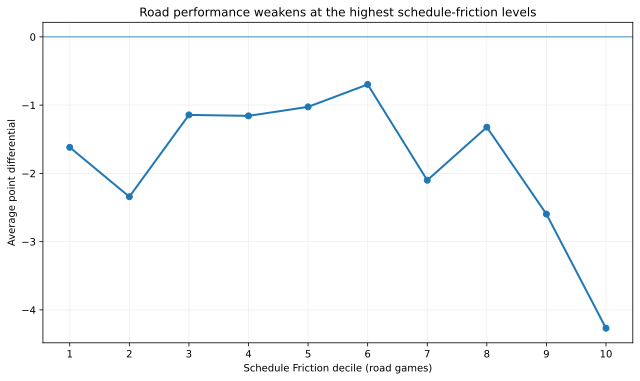
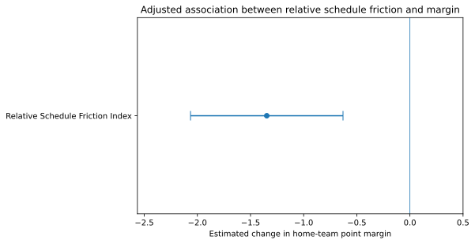
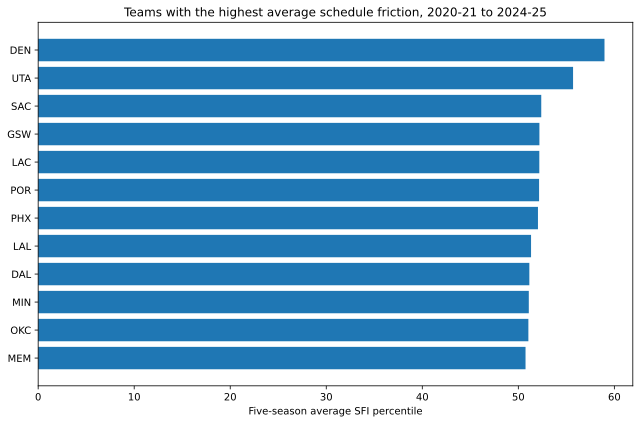
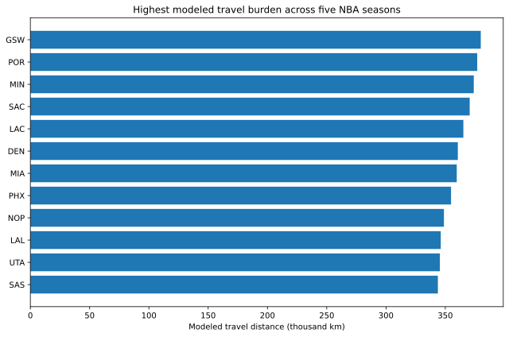

# Travel Tax: NBA Schedule Friction & Competitive Equity

### A five-season geospatial analysis of whether NBA schedule geography is associated with game performance

**Python · pandas · geospatial distance modeling · statsmodels · Plotly · Streamlit**

## Research question

NBA teams do not experience the schedule equally. A road game can follow a short regional trip or a cross-country flight, a full-rest day or a back-to-back, a stable time zone or a multi-zone shift.

> **Does relative schedule burden predict NBA game performance after accounting for recent team strength, season, and team effects?**

This project analyzes **five completed NBA seasons (2020-21 through 2024-25)**: **6,000 regular-season games and 12,000 team-game observations**.

## Schedule Friction Index

I built an original, outcome-independent **Schedule Friction Index (SFI)** from six pre-game exposures:

- travel distance since the previous game
- absolute time-zone shift
- rest deficit
- games played in the previous seven days
- consecutive road-game streak
- positive altitude gain

Each component is standardized within season and equally weighted. **Game outcomes are not used to construct the index.**

## Main result

In the primary fixed-effects model, a **+1 unit increase in relative SFI** is associated with a **1.35-point lower home-team margin**.

- Estimate: **-1.35 points**
- 95% CI: **-2.06 to -0.63**
- p-value: **0.00023**
- Primary model sample: **5,596 games**

A separate win-probability model estimates an average **4.0 percentage-point decline in predicted win probability** for a +1 relative-SFI increase.

Road-game performance also weakens at the extremes:

| Road-game group | Win rate | Avg. margin | Avg. modeled travel |
|---|---:|---:|---:|
| Lowest SFI decile | 44.5% | -1.62 | 725 km |
| Highest SFI decile | 37.9% | -4.27 | 1,600 km |

These are observational associations, not proof that travel or fatigue causes a specific game result.

## Why the geography matters

The pipeline explicitly handles changing and neutral venues rather than assigning every game to a team's normal arena.

Examples include:

- Toronto's temporary 2020-21 home base in Tampa
- the Clippers' move to Intuit Dome in 2024-25
- NBA regular-season games in Mexico City and Paris
- the 2024 NBA Cup semifinals in Las Vegas

Nine neutral/global regular-season games are geocoded to their actual host venue and retained in travel calculations, but excluded from the primary home-vs-away regression.

## Model design

Primary specification:

~~~text
home margin ~ relative SFI
            + pre-game 10-game form differential
            + season fixed effects
            + home-team fixed effects
            + away-team fixed effects
~~~

- HC3 robust standard errors
- 5,991 non-neutral games available for home/away pairing
- 5,596 games in the primary model after lagged-form requirements
- separate binomial model for win probability

## Selected results

## Repository structure

~~~text
.
├── README.md
├── app.py
├── requirements.txt
├── data/
│   └── DATA_LOG.md
├── docs/
│   ├── NBA_Travel_Tax_Findings_Brief.pdf
│   └── PROJECT_DESCRIPTION.md
├── figures/
│   ├── primary_model_effect.svg
│   ├── road_friction_vs_margin.svg
│   ├── team_schedule_friction.svg
│   └── team_travel_burden.svg
├── notebooks/
│   └── NBA_Travel_Tax_Findings.ipynb
├── outputs/
│   ├── FINDINGS.md
│   ├── findings.json
│   ├── road_deciles.csv
│   ├── team_burden.csv
│   └── model_games.csv
└── src/
    ├── analysis.py
    └── build_assets.py
~~~

## Reproduce

~~~bash
pip install -r requirements.txt
python src/analysis.py
python src/build_assets.py
streamlit run app.py
~~~

The GitHub Actions workflow runs the same analysis and asset build, then commits the generated outputs back to the repository.

## Data note

The source game logs are public NBA-derived team-game data. This repository does **not** contain private team travel, medical, sleep, or player-tracking information.

## About

Built by **Samir Sadman**, HBSc candidate at the University of Toronto studying **Geospatial Data Science and Economics**.

[LinkedIn](https://www.linkedin.com/in/samir-sadman-085bb8222/) · [GitHub](https://github.com/ssadman24)
